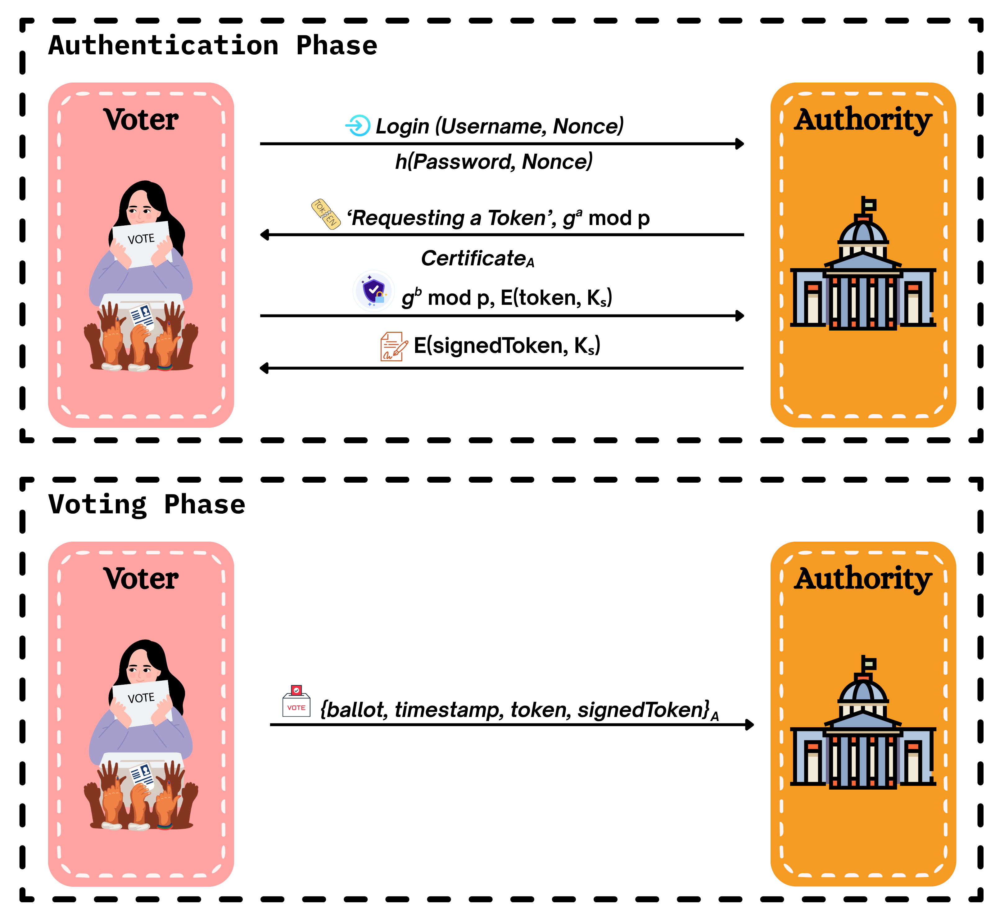

<!-- ---------------------------------------------------------------- -->
<!-- 🔐 PROJECT HEADER -->
<!-- ---------------------------------------------------------------- -->

<h1 align="center">
  
  
  
   
  🔐 Secure Voting Protocol for Class Elections 🗳️  
</h1>

<h3 align="center">🛡️ A Cryptographically Secure, Anonymous, and Verifiable E-Voting System</h3>

  <em>Developed as part of the Information Security module — Faculty of Engineering, University of Ruhuna</em>  

  
  
  
  
  

---

This project implements a secure voting protocol designed to ensure **four fundamental security properties**:

- ✅ **Authentication** of voters  
- 🔐 **Confidentiality** of votes  
- ✅ **Integrity** of ballots  
- 🕵️ **Anonymity** of voters  

The system is logically divided into two core phases: **Authentication** and **Voting**.

---

## 🔑 Authentication Phase

1. **Voter Login with Nonce**  
   The voter initiates authentication by entering their username and generating a one-time random **nonce**.  
   They compute a digest:  `h(password || nonce)`  
   and send it to the **Election Authority (EA)**. The EA verifies this using its securely stored password hashes.

✅ This mechanism prevents:
- Password exposure in plaintext  
- Replay attacks via one-time nonces  
- Impersonation without password knowledge

2. **Key Exchange and Token Issuance**  
- Once authenticated, the EA sends its **Diffie-Hellman (DH) public key** and **RSA-signed certificate** to the voter.  
- The voter verifies the certificate to confirm EA’s identity.  
- The voter then:
  - Generates their own DH key pair  
  - Computes a shared session key `Ks = g^ab mod p`  
  - Creates a **pseudonymous token** (UUID format)  
  - Encrypts the token using the shared key `Ks`  
  - Sends the encrypted token to the EA  

3. **Token Signing by EA**  
- EA decrypts the token and signs it with its **RSA private key**  
- The signed token is encrypted again using `Ks` and returned to the voter  
- EA records that the voter has been issued a signed token (to prevent multiple voting)

🛡️ **Security Goals Achieved in this Phase**:
- **Confidentiality**: The token is only visible to the voter and EA  
- **Integrity**: The signed token proves it hasn't been tampered  
- **Authentication**: Both voter and EA verify each other  
- **Anonymity**: The token contains no voter-identifiable data

---

## 🗳️ Voting Phase

1. **Vote Commitment**  
- The voter selects a candidate  
- Computes a **ballot** using: `h(vote)`  
  This commits to their choice *without revealing* the vote itself.

2. **Payload Preparation**  
The voter creates a payload consisting of:
- Ballot hash  
- Timestamp  
- Token  
- Signed token  

This is **encrypted using EA’s RSA public key** and sent.

3. **EA Vote Processing**  
EA decrypts the payload and:
- Validates the **timestamp** (must be recent)  
- Verifies **signature on token** to ensure it's legitimate  
- Ensures **token is issued only once per voter**

4. **Ballot Storage**  
- If valid, the hashed ballot is stored  
- No user identity is ever stored with the ballot

5. **Vote Tallying**  
- After voting ends, EA compares stored ballot hashes against known candidate name hashes:
  `h("A. Alice"), h("B. Bob"), ...`  
- Votes are counted by matching these hashes

🛡️ **Security Goals Achieved in this Phase**:
- **Anonymity**: Only ballot hash is stored  
- **Integrity**: Only valid signed tokens are accepted  
- **Confidentiality**: Vote payload is encrypted  
- **Freshness**: Timestamp must be within allowed time window

---

## 🧩 System Design Diagram

The following diagram illustrates the flow of the Secure Voting Protocol across the Authentication and Voting phases:

---
